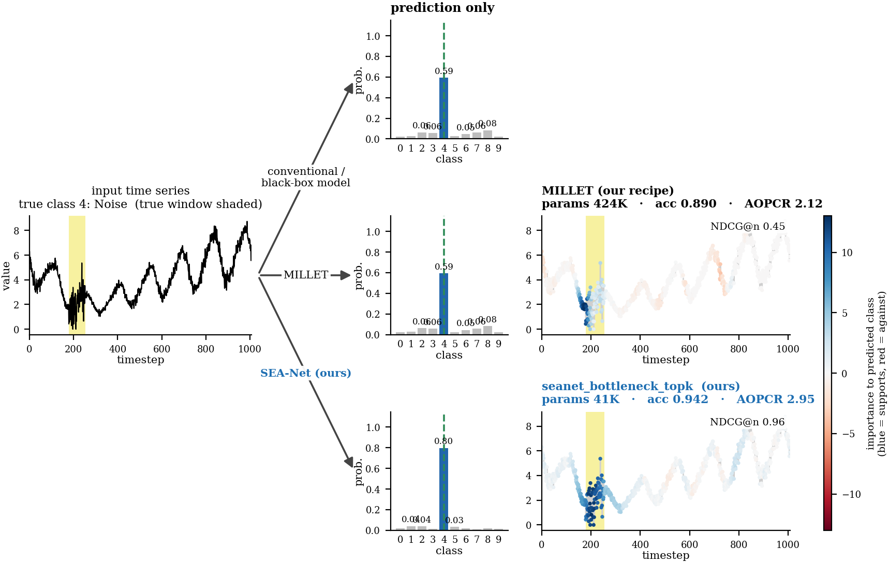

# Explainable Time Series Classification for Edge AI

**Machine Learning / Edge AI research internship, 2026**
Inria, CRIStAL Laboratory (FOX team), Lille, France

*The same time series passed to three models. A black-box model gives only a prediction. MILLET and SEA-Net also show which part of the signal supports the prediction (blue = supports, red = against). SEA-Net's explanation stays on the important part of the signal (shaded yellow).*

## The problem

Imagine a patient's heartbeat recorded over time. The model should predict whether the patient is healthy or sick, **and** show which part of the signal supports that prediction.

For example, if the model predicts *sick*, it can highlight the seconds of the recording where an important heartbeat pattern appears. The prediction is then easier to understand and check, instead of being a black box.

## Starting point: MILLET

We started with **MILLET**, an existing model that explains its predictions. It reaches about **89% accuracy**, but it is heavy and not suitable for fast inference on phones and small devices.

## My work: SEA-Net

I studied the existing model and designed **SEA-Net**, a new lightweight architecture. The goal was to make the model much smaller while keeping good accuracy and the ability to explain its predictions.

## Main results

| | MILLET | SEA-Net (ours) |
|---|---|---|
| Model size | baseline | **about 10× smaller** |
| Accuracy | about 89% | **about 94%** |
| Explanations | spread across the signal | **focused on the important part** |

SEA-Net is smaller, more accurate and easier to trust, which makes it a good fit for **Edge AI / TinyML** applications.

## What I worked on

- Understanding the problem and studying the existing model
- Designing a new, lighter architecture
- Testing accuracy and explanation quality
- Thinking about real-world deployment on small devices

**Skills:** deep learning, time series, model design, optimisation, explainability, AI software engineering.

## Status

The results are promising, and we are preparing the work for a conference submission. More details will be shared once the paper is published.

## Contact

I'm open to opportunities in Data Science, Machine Learning, AI Engineering and Edge AI. If you're working on a time-series or AI problem, feel free to reach out.

📫 [ubaidfr404786@gmail.com](mailto:ubaidfr404786@gmail.com) · [LinkedIn](https://www.linkedin.com/in/ubaid-ur-rehman-422212177/)
